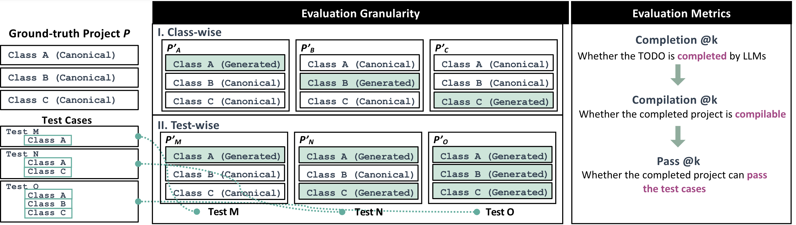

# JavaBench: A Benchmark of Object-Oriented Code Generation for Evaluating Large Language Models

JavaBench is a project-level Java benchmark that contains four projects at graduate-level difficulty. The difficulty and quality of JavaBench is validated and guaranteed by graduate students across four years. Please check our [Leaderboard](https://java-bench.github.io/leaderboard.html) for the visualization of the evaluation results.

## Updates

- 2024-06-08 Publish benchmark and leaderboard
- 2024-07-24 Add instructions for submitting results

## Benchmark Dataset

The four Java projects in JavaBench are designed for undergraduate students throughout the four aca-demic years from 2019 to 2022. We then use students’ overall scores as evidence of difficulty levels.


The benchmark dataset is accessible at `./datasets`. We provide three types of datasets with difference context settings.

- Maximum Context: The dataset contains the context information as much as possible (Limited by LLMs).
- Minimum Context: The dataset contains the no context information.
- Selective Context: The dataset contains the context information that only includes method signatures of dependencies extracted by [jdeps](https://docs.oracle.com/en/java/javase/11/tools/jdeps.html).

Below is the structure of the dataset:

- `task_id`: The ID of the completion task, composed of the assignment number and class name.
- `target`: The file path of the task in the Java project.
- `code`: The code snippet that needs to be completed with `// TODO`.
- `code_context`: The context information that provides additional information for code completion.

Here is a skeleton of `code`:


## Generation Strategies


## Usage

### Setup

Create python virtual environment and install all the requirements.

```bash
python -m venv .venv
source .venv/bin/activate
pip install -r requirements.txt
```

### Inference

We provide `inference.py` to generate code snippets based on the trained models. The following is an example of generating code snippets using the WizardCoder-Python-34B-V1.0 model.

We recommend that sample numbers should be set to 5 or more for precise evaluation results.

```bash
python inference.py \
    --model-path WizardLM/WizardCoder-Python-34B-V1.0 \
    --num-sample 5 \
    --output output/result-PA19/WizardCoder-Python-34B-V1.0/samples.jsonl \
    --data datasets/selective-context/data-PA19.jsonl \
    --mode holistic
```

The inference functionality is implemented based on the command-line tool of FastChat. FastChat supports specifying models from Hugging Face or local models, as well as configuring underlying options such as device and GPU. For more details, please refer to https://github.com/lm-sys/FastChat.

Based on the parameters provided by FastChat, we have added additional parameters:

| Argument               | Type                                         | Default    | Description                                                             |
| ---------------------- | -------------------------------------------- | ---------- | ----------------------------------------------------------------------- |
| `--data`               | str                                          | (required) | Path to the input dataset file                                          |
| `--output`             | str                                          | (required) | Path to save the output                                                 |
| `--mode`               | "holistic" \| "independent" \| "incremental" | "holistic" | Synthesis strategy: holistic, independent, or incremental               |
| `--num-sample`         | int                                          | 10         | Number of samples that each class should generate                       |
| `--incremental-mode`   | "seq" \| "rev" \| "rand"                     | "seq"      | Mode for incremental synthesis strategy: sequential, reverse, or random |
| `--temperature`        | float                                        | 0.2        | Sampling temperature for generation                                     |
| `--repetition_penalty` | float                                        | 1.0        | Penalty for repetition in generation                                    |
| `--max-new-tokens`     | int                                          | 4096       | Maximum number of new tokens to generate                                |

Below are the instructions for the inference output format:

- `task_id`: The ID of the completion task, composed of the assignment number and class name.
- `prompt`: The combined prompt given to LLMs, including code and context.
- `target`: The file path of the task in the Java project.
- `completion`: The result of the inference.
- `mediate`: For independent and incremental synthesis strategies, this field records the intermediate steps.

### Evaluation



We provide `evaluation.py` to evaluate the generated code snippets based on the test cases.

There are two evaluation granularities.

#### Class-wise

Class-wise granularity uses a generated class to replace the canon-ical solution’s counterpart class at a time.

```bash
Usage: evaluation.py class-wise [OPTIONS] DATA

Options:
  --output TEXT  Output file for evalution  [required]
  --help         Show this message and exit.
```

For example:

```bash
python evaluation.py class-wise \
    --output output/result-PA21/gpt-3.5-turbo/single_class.json \
    output/result-PA21/gpt-3.5-turbo/samples.jsonl
```

Below are the instructions for the class-wise evalution output format:

- `task_id`: The ID of the completion task, composed of the assignment number and class name.
- `compile_errors`: The number of compilation errors, where 0 indicates successful compilation.
- `test_result`: Two numbers representing the number of passing test cases and the total number of test cases for the project. This result is only available if the compilation is successful.
- `has_todo`: Indicates whether the inference result contains `// TODO`, as LLMs may exhibit laziness.
- `can_replace`: Indicates whether the inference result contains a complete class.

#### Test-wise

Test-wise granularity iterates all the test cases in the test suites and takes the average result. For each test case, we replace the classes relating to the test case while keeping other classes in the canonical solution unchanged.

```bash
Usage: evaluation.py test-wise [OPTIONS] DATA

Options:
  --output TEXT  Output file for evalution  [required]
  --test TEXT    Test configuration for evaluation  [required]
  --help         Show this message and exit.
```

For example:

```bash
python evaluation.py test-wise \
    --output output/result-PA19/gpt-3.5-turbo/result-full.json \
    --test dataset/testcase/test-PA19.jsonl \
    output/result-PA19/gpt-3.5-turbo/samples.jsonl
```

By default, the `evalution.py` will print all the gradle build log to stderr. You can redirect the log to a file by adding `2> log.txt` at the end of the command.

Below are the instructions for the class-wise evalution output format:

- `test_id`: The ID of the test suite, composed of the assignment number and test suite name.
- `compilable`: Indicates whether the generated code is compilable.
- `n_pass`: Two numbers representing the number of passing test cases and the total number of test cases for the project. This result is only available if the compilation is successful.
- `has_todo`: Indicates whether the inference result contains `// TODO`, as LLMs may exhibit laziness.
- `can_replace`: Indicates whether the inference result contains a complete class.

### Submission

Now you have three files:

- `samples.jsonl`: Completed code generated by LLMs.
- `single_class.json`: Evaluation results of class-wise granularity.
- `result-full.json`: Evaluation results of test-wise granularity.

**If you're having trouble with the evalution step, you can just upload `samples.jsonl` and we'll evaluate it for you!**

The next step is to submit a pull request for the project:

1. [Fork](https://help.github.com/articles/fork-a-repo/) the repository into your own GitHub account.
2. [Clone](https://docs.github.com/en/repositories/creating-and-managing-repositories/cloning-a-repository) the repository to your local.
3. Checkout a new branch from main.
4. Make a new directory under the output folder corresponding to the dataset(e.g. `./output/holistic-selective/result-PA19/gpt-3.5-turbo-1106`) and copy all the files above.
5. Submit the Pull Request.
6. The maintainers will review your Pull Request soon.

Once your pull request is accepted, we will update the [Leaderboard](https://java-bench.github.io/leaderboard.html) with your results.

## Contributors

## Citation
